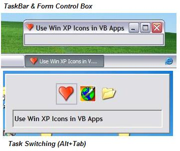



## Use Win XP Icons in VB Apps

### Description

I needed to use windows xp (32-bit alpha icons) icons in my vb app, but vb does not supports them. one day I found a example on vbaccelerator, the vbaccelerator example was fully working but I found one problem with it. the example shown at vbaccelerator needed we should make a Resource Script, in other words the resource file should be manually made. this article shows how you can use xp style icon for the follwing conditions: 1. without using resource at all or without breaking you existing resource file. Plese Vote If You Found this Usefull.
 
### More Info
 

             |
---                |---
**Submitted On**   |2005-02-20 01:53:34
**By**             |[Abhishek\.NET](https://github.com/Planet-Source-Code/PSCIndex/blob/master/ByAuthor/abhishek-net.md)
**Level**          |Intermediate
**User Rating**    |4.6 (88 globes from 19 users)
**Compatibility**  |VB 4\.0 \(32\-bit\), VB 5\.0, VB 6\.0
**Category**       |[Custom Controls/ Forms/  Menus](https://github.com/Planet-Source-Code/PSCIndex/blob/master/ByCategory/custom-controls-forms-menus__1-4.md)
**World**          |[Visual Basic](https://github.com/Planet-Source-Code/PSCIndex/blob/master/ByWorld/visual-basic.md)
**Archive File**   |[Use\_Win\_XP185945312005\.zip](https://github.com/Planet-Source-Code/abhishek-net-use-win-xp-icons-in-vb-apps__1-59231/archive/master.zip)

